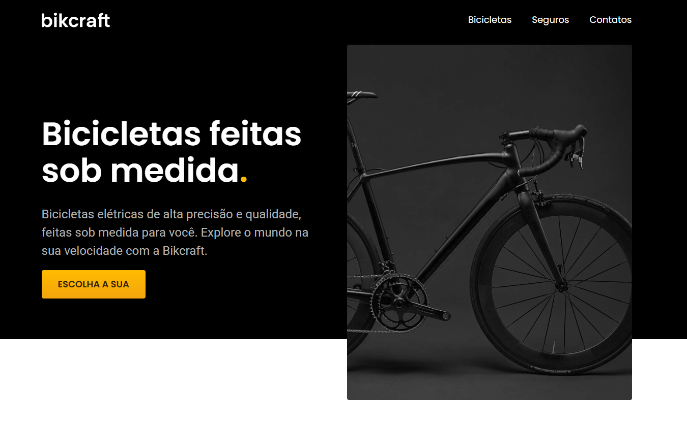
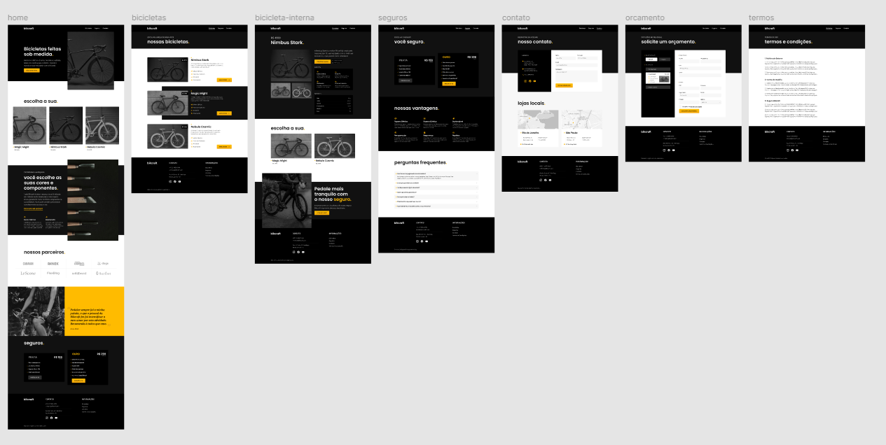

# BIKCRAFT - Fictional Bicycle Company Website

This project is a static website developed for BIKCRAFT, a fictional bicycle company. It serves as a comprehensive online presence, showcasing various bicycle models, providing detailed information on insurance options, facilitating quote requests, and offering essential contact details. The website is built with a focus on modern web standards and responsive design principles to ensure optimal viewing across all devices.

## 🚀 Features

- **Home Page**: An engaging and informative landing page introducing the BIKCRAFT brand and its offerings.

- **Bicycles Page**: A dedicated section displaying the diverse range of bicycle models with detailed descriptions.

- **Insurance Page**: Comprehensive information regarding available bicycle insurance plans.

- **Quote Request**: An intuitive form allowing users to easily request personalized quotes for bicycles and services.

- **Contact Page**: All necessary contact information for BIKCRAFT, including location and communication channels.

- **Terms and Conditions Page**: A clear outline of the company's legal terms and conditions.

- **Responsive Design**: Ensures a seamless and optimal user experience across various screen sizes, from desktops to mobile devices.

## 💻 Technologies Used

This project leverages fundamental web technologies:

- **HTML5**: For structuring the content and defining the semantic layout of the website.

- **CSS3**: For styling the website, including layout (Flexbox, Grid), typography, and visual aesthetics.

- **JavaScript**: For enhancing interactivity and dynamic elements within the website.

## ⚙️ Installation and Usage

To set up and run this project locally, please follow these steps:

1. **Clone the repository**:

   ```bash
   git clone https://github.com/GunnarOliveira/BIKCRAFT-PROJECT.git
   ```

1. **Navigate to the project directory**:

   ```bash
   cd BIKCRAFT-PROJECT
   ```

1. **Open ****`index.html`**** in your browser**:Locate the `index.html` file in the root of the project directory and open it with your preferred web browser to view the website.

## Live Preview 🔗

You can view a live demonstration of the project [here 🎯](https://GunnarOliveira.github.io/BIKCRAFT-PROJECT/).

## 👀 Demo Screenshots

Below are screenshots illustrating the website's design and responsiveness:

### Home Page Desktop Layout:



### Overview Layout:



## 🤝 Contributing

Contributions are highly encouraged and greatly appreciated! If you wish to contribute to this project, please follow these guidelines:

1. Fork the Project.

1. Create your Feature Branch (`git checkout -b feature/AmazingFeature`).

1. Commit your Changes (`git commit -m 'Add some AmazingFeature'`).

1. Push to the Branch (`git push origin feature/AmazingFeature`).

1. Open a Pull Request.

## 📄 License

This project is distributed under the MIT License. For more details, please refer to the `LICENSE` file in the repository.

## 📧 Contact

Gunnar Oliveira - [GitHub Profile](https://github.com/GunnarOliveira)

Project Link: [https://github.com/GunnarOliveira/BIKCRAFT-PROJECT](https://github.com/GunnarOliveira/BIKCRAFT-PROJECT)

Feel free to explore the project, provide feedback, or suggest improvements. And remember, **Jesus Loves You!** ✨
